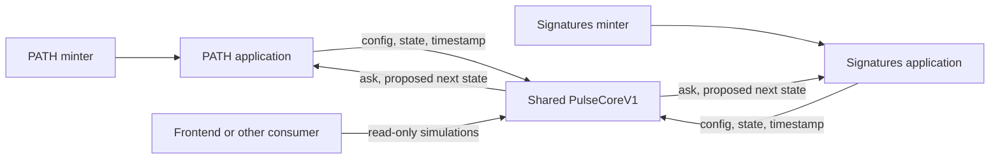

# Plan: public stateless Pulse core (Approach B)

Status: Pulse Tasks 1–3, 5A and 5B are complete locally. Task 6's current scope is complete through the Anvil core/reference-consumer rehearsal and verified Sepolia core/two-consumer rehearsal. Ethereum mainnet deployment is deferred by user direction. The reviewed core build is frozen. Task 4 is a separate downstream workstream owned by the PATH and signatures.gallery repositories; their real-application Anvil tests have not been run by this Pulse task.

Task 1's normative result is [Pulse Core V1 API and numerical specification](pulse-core-api.md). It resolves the API, validation and error choices below. Application product defaults remain proposals until recorded in the downstream specifications.

The selected architecture is one public, stateless Pulse core per supported chain and release. PATH, signatures.gallery, and other applications call that core through its interface. Each application owns its auction state, activation policy, payment, and delivery. Applications do not deploy their own Pulse core or compile its calculation implementation into their contracts.

This plan treats PATH's present wiring as refactorable. Existing code is evidence of behavior and migration work, not the required architecture. The signatures.gallery requirement is authoritative: fulfillment of 1,024 initial allowlist slots starts its Pulse opening curve.

## 1. Decisions and scope

| Decision | Proposed V1 design |
| --- | --- |
| Public engine | `PulseCoreV1`, callable by any application, wallet, or frontend |
| Engine state | No auction storage, caller registration, balances accounting, or caller-specific configuration |
| Calculation API | `initialize`, `quote`, `advance`; explicit configuration, state, and time inputs |
| Authority | No owner, pause, upgrade proxy, mint role, treasury, or payment collection in the core |
| Calling convention | Ordinary typed calls through an `external pure` interface; no delegatecall |
| Application binding | Application pins its selected core address; no caller-supplied engine override |
| Application state | Config, live curve state, activation flag, block restriction, issuance and payment state remain local |
| Lifecycle | Application decides when to initialize; initialization is enforceably one-time in that application |
| Economic behavior | Preserve the existing integer curve and transition rules; separately specify validation hardening |
| Public release identity | Versioned ABI/source/build, deployed runtime code hash, chain ID, and address |

Implementation source is factored into an internal `PulseMath` module within this repository. That is an implementation detail of the shared core. Downstream applications need only the small interface/types or an equivalent ABI, not that calculation source.

V1 does not need a factory, clone, application registry, router, fee collector, keeper, hosted calculation API, or upgrade administrator. Additional tooling may be published without putting these components in the execution path.

## 2. Architecture and ownership



| Responsibility | Core | Application |
| --- | --- | --- |
| Initialize curve, calculate ask, calculate next curve | Yes | Calls core |
| Validate numerical inputs and representability | Yes | Supplies approved parameters |
| Establish that inputs are the real auction state | Cannot | Yes |
| Decide opening condition and current transaction time | Cannot | Yes |
| Store state and advance once per successful sale | Cannot | Yes |
| Enforce one successful sale per application per block | No | Yes |
| Enforce slippage, payment amount, and refunds | No | Yes |
| Validate mint eligibility and deliver the asset | No | Yes |
| Emit launch, sale, and token events | No | Yes |
| Prevent purchase/claim reentrancy and bypass routes | No callbacks or mutable state | Yes |

Core calls are calculations, not authenticated sale records. Two consumers can pass identical inputs and receive identical outputs without either having a real auction. The core must never be used as proof that a caller paid or that a historical state is genuine.

## 3. Frozen V1 public interface

The following summarizes the frozen interface. Field order, widths, names, units and custom errors are versioned ABI commitments. See [IPulseCore.sol](../../evm/src/interfaces/IPulseCore.sol) and the [normative specification](pulse-core-api.md) for all errors and their precedence.

```solidity
interface IPulseCore {
    struct Config {
        uint256 k;
        uint256 genesisPrice;
        uint256 genesisFloor;
        uint256 pts;
    }

    struct State {
        uint64 epochIndex;
        uint64 openTime;
        uint64 curveStartTime;
        uint64 anchorTime;
        uint256 floorPrice;
    }

    function initialize(Config calldata config, uint64 startTime)
        external pure returns (State memory initialState);

    function quote(Config calldata config, State calldata state, uint64 timestamp)
        external pure returns (uint256 ask);

    function advance(Config calldata config, State calldata state, uint64 timestamp)
        external pure returns (uint256 ask, State memory nextState);

    function version() external pure returns (bytes32 versionId);
}
```

- Prices are raw payment units: wei for ETH, token base units for ERC20. No decimal conversion occurs in the core.
- Time is integer seconds; `k` is price units times seconds, and `pts` is price units per second.
- The application owns and freezes `Config` for the life of its auction. Changing it after opening is not part of the V1 integration contract.
- `openTime` is included in supplied state so the core can preserve canonical pre-open quote behavior. Its inclusion is not engine storage.
- `lastBlock`, initialization flags, payer, recipient, treasury, currency, signatures, nonce, token ID, and mint data do not belong in the core state or API.
- `versionId = keccak256(bytes("pulse-core/1.0.0"))` identifies the released semantics/ABI. It is not sufficient to authenticate a deployment: consumers also verify the approved runtime code hash/address.
- The deployed core has no receive/fallback payment path; functions are nonpayable. No application sends the purchase value to it.
- A frontend can call the core directly using `eth_call`. An application needs no registration to call it.

### `initialize`

Validate config and start-time arithmetic, then return epoch 0 with:

```text
openTime       = startTime
curveStartTime = startTime
floorPrice     = genesisFloor
anchorTime     = startTime - floor(k / (genesisPrice - genesisFloor))
epochIndex     = 0
```

This can be called repeatedly and with historical or future times for simulation. The pure core cannot check `startTime >= block.timestamp`, remember initialization, or activate a real application. The application supplies the correct time and enforces one-time initialization.

### `quote`

Validate mathematical config/state shape. For epoch 0, clamp a timestamp before `openTime` to `openTime`. For a later epoch, reject timestamps before that epoch's `curveStartTime`; a later state must not be presented as the historical curve for an earlier time.

```text
effectiveTime = max(timestamp, openTime)    // epoch 0 pre-open handling
ask = floorPrice + floor(k / (effectiveTime - anchorTime))
```

If `effectiveTime <= anchorTime`, retain the existing clamp `ask = floorPrice + k`. Return the price only. Historical reconstruction uses the appropriate historical state from application events.

### `advance`

Reject timestamps earlier than `openTime` or the current epoch start. Derive the ask internally using exactly the quote calculation; callers must not supply a purported sale price. Calculate:

```text
ask           = quote(config, state, timestamp)
elapsed       = timestamp - state.curveStartTime
premium       = max(elapsed, 1) * pts
nextFloor     = ask
initialAsk    = ask + premium               // checked addition is required
nextAnchor    = timestamp - floor(k / (initialAsk - nextFloor))
nextStart     = timestamp
nextEpoch     = state.epochIndex + 1
nextOpenTime  = state.openTime
```

The anchor denominator equals `premium`, but the preceding `ask + premium` overflow guard must not be removed: it preserves the existing overflow rejection. Before returning, apply the required representability validation below to the next state's opening quote.

Return `(ask, nextState)` without changing any storage. Directly calling this function cannot buy a token or advance another contract's state. The application calls it once in a purchase, uses the returned ask for payment, and commits the proposed state if the complete transaction succeeds.

## 4. Mathematical compatibility and valid domain

The current Solidity implementation and independent BigInt model establish the arithmetic baseline. First extract without changing successful calculations. Avoid an apparently equivalent rearrangement that changes integer-division order.

### Preserve these behaviors

- `k > 0`, `genesisPrice > genesisFloor`, and initial price gap `<= k`.
- `0 < pts <= uint128.max`, and `k / pts <= uint64.max`.
- Initial and later anchors must fit `uint64` without underflow.
- Bounded `uint256` arithmetic and `uint64` epoch increment; no wrapping or silently saturated results. V1 names domain failures with custom errors rather than inheriting legacy panic selectors.
- Minimum effective elapsed time is one second, including sales with the same timestamp in different blocks.
- When `premium > k`, the next anchor equals the sale timestamp and the opening quote is clamped to `nextFloor + k`.
- The first purchase consumes epoch 0; no extra genesis-sale path is introduced.

### Document rounding accurately

`genesisPrice` is the target used to derive the initial anchor. Integer division means the actual opening quote can be above that target. Likewise, the immediate quote of the next curve is not necessarily exactly `ask + premium`. When the premium exceeds `k`, the clamp limits the immediate increment to `k`.

Task 1 corrects existing prose claiming exact equality. Preserve the implemented economics unless a separate curve change is deliberately specified and tested.

### Public-input validation

The frozen external entrypoints validate config bounds, launch domain and basic state chronology. `advance` validates once and calls an internal quote helper rather than repeating validation through another external core call.

State shape checks include a valid original launch, `curveStartTime >= openTime`, `0 < anchorTime <= curveStartTime`, and `floorPrice >= genesisFloor`. Epoch-0 state must match initialization for that config/open time. Every supplied state must have a representable opening quote. These checks reject malformed inputs, but cannot prove subsequent states arose from actual sales.

Task 1 freezes explicit custom errors and validation precedence for configuration, launch, state, time, price and epoch failures. `TargetPriceOverflow()` preserves the checked transition-target addition; `PriceOverflow()` covers rounded quote overflow. Typed inputs cannot overflow the premium multiplication under the chosen bounds. Unexpected arithmetic panics are implementation defects, not the specified domain-error API. See [the error table](pulse-core-api.md#4-errors-and-precedence).

### Deliberate V1 domain hardening

Current constructor checks can accept parameters for which an immediate first transition underflows its next anchor: the start can be no greater than `k / pts`, even though its initial anchor is valid.

Frozen V1 rules, to test separately from shared-domain arithmetic parity:

1. `initialize` requires `startTime > max(k / (genesisPrice - genesisFloor), k / pts)`. Compare full-width offsets before narrowing. Since every later premium is at least `pts` and sale times are at least `startTime`, this prevents that class of later anchor underflow and preserves the strict initial-anchor check.
2. `initialize` evaluates the candidate state's opening quote under checked arithmetic before returning. Initial anchor construction alone does not guarantee that the rounded opening quote fits `uint256`.
3. `advance` retains checked `ask + premium` and evaluates the candidate next state's opening quote before returning. It must not report a successful transition to a state whose immediate quote overflows.

These narrow the admitted initialization/transition domains; they are not described as behavior-neutral extraction. Isolate them in review and tests. Preserve results for states/transitions admitted by both versions. Applications validate initialization and simulate the first purchase against a conservative earliest intended launch time before starting an initial allocation phase, so the last allocation is not exposed to an avoidable launch-parameter failure.

Explicit regression vectors include: `k=1, pts=2, genesisFloor=uint256.max-1, genesisPrice=uint256.max, startTime=100`, where legacy advance rejects checked `ask + premium`; and `k=10, pts=1, genesisFloor=uint256.max-6, genesisPrice=uint256.max, startTime=100`, where an apparently valid initial anchor would produce an overflowing opening quote. Review these as mathematical boundary tests, not realistic application price settings.

Finite integer ranges also mean that extremely large accumulated floors or asks can eventually become unrepresentable. Document this failure domain and test it; do not promise an infinite number of transitions or add a price clamp that silently changes the economics.

## 5. Application integration contract

Each application stores:

```text
immutable pulseCore address
frozen Pulse config
Pulse state
initialized flag / application phase
last successful Pulse sale block
deployment timestamp (if exposing existing launch event semantics)
application-specific payment, issuance, eligibility and administration state
```

Deployment verifies that the core has code and matches an approved release runtime code hash, then pins the address. Publish the expected hash in release tooling/interface metadata, not a caller-controlled purchase argument. The V1 reference integration has no owner-operated core replacement setter.

For every state-changing operation, obtain config/state from application storage and time/block from the execution environment. Do not accept a user's quoted ask, state, timestamp, epoch, or engine address as authoritative. Check narrowing conversions if retaining `uint64` block/time storage.

Consumers can implement their own application code. A minimal conformance consumer and checklist are provided for testing; inheriting a large shared application base is not a requirement for using the public core.

### Authoritative read interface

An application provides `pulseCore()`, `getConfig()`, `getState()`, `getEpochIndex()`, `curveActive()`, and `getCurrentPrice()` or equivalent documented views. Preserve existing view tuple shapes where current integrations rely on them, with a separate `initialized()` getter if needed.

- Uninitialized conditional-launch application: `curveActive()` is false; no canonical opening timestamp exists; `getCurrentPrice()` reverts with an explicit not-initialized error. UI can show configured opening targets without claiming a live ask.
- Scheduled but unopened application: initialized state exists; `curveActive()` is false and `getCurrentPrice()` returns the opening curve's pinned ask.
- Open application: `getCurrentPrice()` supplies stored config/state and current block time to the core.
- If an application pauses purchases, expose pause/purchase availability separately from curve timing. Proposed default: the curve clock continues; pause does not reset its anchor, epoch, or opening time.

For RPC composition, fetch config/state/block timestamp at the same block tag. A frontend quote is a preview; execute a fresh calculation in the purchase and honor `maxPrice`.

### Purchase transaction order

1. Enter the application's reentrancy guard. Check phase, pause policy, eligibility, available supply, authorization, and `block.number > lastBlock`.
2. Read canonical config/state and call `core.advance(config, state, block.timestamp)` once.
3. Require `ask <= maxPrice`. Check native/erc20 payment requirements and all application mint inputs.
4. Commit proposed Pulse state, block marker, nonce/handle reservations, supply reservations, and other issuance effects before callback-capable settlement/delivery.
5. Settle payment and deliver the asset. Retain payment-before-delivery semantics for migrated flows; native refund timing must be explicit and covered by rollback tests.
6. Emit the application sale and issuance events with the actual ask and committed epoch.

Any treasury, refund, ERC20 transfer, mint, or receiver failure reverts the entire transaction. Do not catch downstream failure and keep a transitioned curve or consumed nonce.

Native ETH requires `msg.value >= ask`, treasury receives exactly `ask`, and the sender receives the surplus. ERC20 mode requires zero ETH and transfer of exactly the nominal ask. Use safe handling of no-return/false-return tokens; do not silently promise support for taxed/rebasing tokens without a separately specified settlement policy.

Guard all callback-reachable functions that share issuance, phase, or auction state, including allowlist fulfillment and purchase aliases. The old auction stored state after adapter settlement; B's recommended effects-before-interactions order is an intentional integration change. Review code that reads epochs inside callbacks.

## 6. Activation policies

### Scheduled opening

The application chooses a non-past `openTime`, computes/stores initial state once, and permits purchases only when the block timestamp reaches it. Pre-open price reads stay pinned. Existing standalone-auction pre-open adapter invariants remain applicable to retained legacy deployments, not to core-owned wiring (there is none).

### signatures.gallery: 1,024-slot opening

Proposed application lifecycle:

```text
INITIAL_ALLOCATION, initialized = false
  -> accepted fulfillment increments the initial-phase count
  -> fulfillment 1024 atomically initializes the curve at block.timestamp
  -> initial allocation closes; auction is active in epoch 0
  -> first paid purchase advances to epoch 1
```

- Eligibility alone does not consume a slot. The exact successful on-chain action that counts as fulfillment must be defined in the signatures application specification.
- Working default: count a successfully completed initial claim/mint. If slots represent finalized reservations instead, adapt the application transition without changing Pulse core.
- Initial allocation fees, if any, remain application-specific. No free-mint assumption is made here.
- Completion and activation happen in one transaction; a failed final fulfillment or failed initialization reverts both.
- The initial phase cannot exceed 1,024 or remain available as a bypass to paid auction issuance after activation.
- The initial count is separate from `epochIndex`. Fulfillment 1,024 does not emit a Pulse `Sale`, increment the Pulse epoch, or consume its one-sale-per-block allowance.
- Proposed default: a later transaction in the same block can make the first Pulse purchase; only a second Pulse purchase in that application/block is prohibited.
- All fulfillment/activation paths share the appropriate guard. If mint delivery invokes callbacks, callbacks cannot purchase or change phase during the final fulfillment.
- The authorized application's configured start time is the final fulfillment timestamp, not the first later purchase or an administrator's discretionary activation time.

## 7. Downstream application workstreams (separate repository ownership)

These notes are handoffs for the application repositories. They are not the next implementation task in this Pulse repository and need not run now. Each application imports the published interface/ABI, binds to the selected deployed core, and adds its own activation, stored state and purchase/mint integration. Pulse provides the stable engine and integration artifacts; it has no project registration or project-specific wiring step.

Application teams can begin against local/testnet core deployments when ready. Each application's production release requires its own end-to-end validation and verified core binding. Pulse's release is gated by its arithmetic, reference-consumer conformance, benchmarks and review, without requiring either real application to migrate first.

### PATH

Preferred new B integration is an application-owned purchase path with internal NFT issuance, calling the shared core only for calculations. PATH's separate renderer or other project-specific components remain independent decisions.

Tasks:

1. Add the pinned core, application-owned Pulse config/state, initialization and public purchase path.
2. Preserve reserved/public token-ID domains, Spark and movement behavior, and mint-authority restrictions.
3. Replace the existing adapter's dependency on `auction.getEpochIndex() + 1`. Derive the public issuance ID from the accepted application's next epoch using a documented mapping; a stateless core has no current epoch getter.
4. Review public mint aliases and privileged mint permissions so no path bypasses the intended purchase policy.
5. Replace auction/adapter addresses and ABI assumptions in deploy scripts, frontend transactions, indexers, tests, and generated integration bundles.
6. Remove the separate Pulse auction/adapter from the selected B deployment path once equivalent application behavior is verified.

If PATH retains a separate NFT and issuance controller for independent product reasons, that controller owns application auction state and calls the shared core. It does not deploy a private Pulse engine. This alternative is not required by B and should not expand the initial refactor unless PATH needs it.

Existing frozen or deployed contracts cannot be assumed mutable. Any live migration would be separately inventoried before changes to addresses/authority. The plan does not infer live deployment status.

### signatures.gallery

The inspected implementation is `contracts/src/release/GenerativeSignaturesV1RC1.sol` in the sibling `Agent-Art-signatures.gallery` repository. It is a release candidate with its own chain/profile restrictions; the 1,024-slot design is new application work.

Tasks:

1. Specify initial fulfillment and encode the two-phase lifecycle above.
2. Add core binding/config and one-time conditional initialization.
3. Add an application-owned paid mint entrypoint including `maxPrice` and the existing handle, MBTI, authorization, and signature inputs.
4. Preserve signed recipient binding, signer/nonce/window validation, canonical handle uniqueness, input commitments, provenance, token identity, and renderer identity.
5. Keep the actual buyer as the application caller. Calling Pulse from inside this function does not change `msg.sender` in the application. The previous adapter-related caller/opaque-payload problem does not exist in B.
6. Preserve existing wallet policy unless that product separately changes it. Pulse core is never granted mint authority and never calls the collection back.
7. Gate every initial/public mint route to prevent post-activation price bypasses.
8. Update backend issuance, wallet transaction construction, receipt projection, release/domain identities, ABI locks, deployment checks, frontend quote/phase display, and recovery tests for the new interface/version.

Chain restrictions and release locks must be deliberately revised for the selected new release; this plan does not authorize removing them incidentally or changing a live application.

## 8. Events, discovery, and indexing

Pure core functions emit no lifecycle or sale events. Events are emitted by each application; identify an auction by `(chainId, applicationAddress)`.

Retain the existing `Sale` field types, indexed fields, names, and meanings in migrated application interfaces:

```solidity
event Sale(
    address indexed buyer,
    uint64 indexed epochIndex,
    uint256 price,
    uint64 timestamp,
    uint64 nextAnchorA,
    uint256 nextFloorB
);
```

`epochIndex` is the newly entered epoch. The first sale closes epoch 0 and emits 1. Application token identity and supply counts are not implicitly equal to that epoch.

Emit core binding information once (address, release/runtime identity) and initialization information at the application. If retaining `LaunchConfigured(openTime, deployedAt)`, preserve `deployedAt` as the original application deployment timestamp; do not substitute delayed activation time. An additional activation event can explicitly report the trigger timestamp if needed.

Keep `genesisTime`, if exposed for compatibility, as the first completed public sale time. It is not the allowlist completion timestamp or a replacement for canonical `openTime`.

Retain or add application issuance events that associate the sale epoch with the delivered token/handle. Update indexers to subscribe to application sale emitters, and publish address-transition metadata for historical streams. Replaying launch/config plus sales must reconstruct every epoch without asking the stateless core for historical storage.

Public discovery can use verified release manifests and examples. No on-chain registration requirement is introduced.

## 9. Repository deliverables

Pulse repository layout (core, reference consumers and benchmark are complete locally; release tooling remains planned):

```text
evm/src/interfaces/IPulseCore.sol          public types and interface
evm/src/core/PulseCoreV1.sol               deployed pure API
evm/src/core/PulseMath.sol                 internal arithmetic used by core
evm/src/mocks/PulseConsumerHarness.sol     minimal independent stateful consumers
evm/src/mocks/PulseConsumerAdversaries.sol callback, delivery and ERC20 failure fixtures
evm/test/pulseCore.spec.test.js            ABI and executable-model tests
evm/test/pulseCore.engine.test.js          on-chain vectors, model/differential and boundary tests
evm/test/fixtures/pulseCore.v1.*.json      frozen ABI and golden vectors
evm/test/pulseCore.consumers.test.js       isolation and integration invariants
evm/src/mocks/PulseEmbedded*Benchmark.sol generated embedded-math A controls
evm/src/mocks/PulseCostQuoteProbe.sol      first/warm on-chain quote probe
evm/scripts/deploy-core.js                local/testnet release deployment
evm/scripts/verify-core.js                bytecode/address/build verification
evm/scripts/benchmark-core.js             reproducible A/B gas comparison
evm/scripts/generate-embedded-control.js  checked control generator
docs/evm/pulse-core-api.md                 final API, units, errors and examples
docs/evm/pulse-core-integration.md         consumer contract and transaction rules
docs/evm/pulse-core-benchmark.md           measured Task 5A gas report
docs/evm/pulse-core-review.md              Task 5B findings, proofs and verification
evm/releases/pulse-core-v1/                frozen input, interface/ABI, vectors and bytecodes
evm/scripts/check-core-release.js         source/build freeze verification
docs/evm/pulse-core-release.md             chain/version manifest and release procedure
```

Publish interface/ABI and golden vectors as a small versioned integration artifact with a documented commit or package version. Do not require applications to vendor the whole repository. Runtime registration is unnecessary.

Keep `PulseAuction.sol` and existing tests as a reference during extraction. It is not deployed as part of B. Update README, EVM README, testing specifications, and AGENTS active-implementation descriptions only when the new implementation has actually reached the relevant milestone. Record any legacy deprecation explicitly rather than silently repurposing the old auction ABI.

## 10. Verification matrix

### Pure arithmetic and domain

- Differential tests against the current Solidity auction at matched states/timestamps and an independent BigInt model. Model fixed-width overflow/revert behavior explicitly where BigInt would not overflow.
- Property/fuzz coverage over valid domains: quote agrees with advance's ask; next floor equals executed ask; epoch increments once; open time is unchanged; next start equals sale time; asks stay at or above floor and do not increase within an unchanged epoch.
- Pre-open, at-open, zero elapsed time, uneven divisions, `premium == k`, `premium > k`, long gaps, representable limits and epoch overflow.
- Invalid config, malformed state, zero/unset state, timestamps before current epoch, anchor underflow, and unrepresentable prices.
- Separate tests for stricter initialization/next-state rejection and opening-quote representability, with unchanged results throughout the common accepted domain. Preserve rejection of checked `ask + premium` overflow even when an algebraically simplified next-anchor calculation would fit.
- Repeat any pure call and obtain the same result; use different sender addresses and the same inputs and obtain the same result.

### Application conformance

- Two applications share one core; interleave purchases and prove no changes to the other application's config, curve, block restriction, balances, or supply.
- Both applications can sell in the same block. A second sale in one application/block fails independently of the other.
- Scheduled pre-open quote/bid behavior; conditional pre-initialization behavior; no repeated initialization or restart.
- Native exact/over/underpayment, refunds, treasury rejection, and refund rejection.
- ERC20 exact nominal transfer, approvals, no-return and false-return behavior, and ETH rejection.
- Slippage and failed delivery leave curve, payment, supply, nonce, handle reservation, and logs unchanged.
- Reentry through treasury, refund, token, NFT receiver, and other callback-capable app paths cannot mutate shared issuance/lifecycle state incorrectly.
- Block/time/config/state/core address come from the application, not user-supplied purchase arguments.
- Release/deployment tooling rejects a chain ID that differs from its manifest. Application binding rejects missing/mismatched runtime code and exposes the pinned identity. A code hash alone does not distinguish chains with identical deployments; any application-level chain restriction is a separate explicit check.

### signatures.gallery-specific

- Counts 0, 1023, 1024, attempts above 1024, duplicate fulfillment and unauthorized fulfillment.
- Failed final fulfillment restores the counter, phase and uninitialized auction state.
- Fulfillment 1024 creates epoch 0 with opening time equal to its successful transaction timestamp and no Pulse Sale.
- Same-block first sale follows the explicitly chosen policy; the next sale is still restricted.
- Existing signature, nonce, expiry, handle, input, provenance, renderer, and wallet-policy tests still hold.
- Initial route cannot bypass auction price after activation.

### Observability and costs

- Replay application events/config into the independent model; compare every stored state and quote.
- Freeze ABI selectors, tuple order, error semantics, release identifiers and event meanings.
- Benchmark core deployment, two equivalent B reference consumers versus A controls, activation, quotes, transitions and representative settlement/delivery paths after ABI/validation choices are final. Actual PATH/signatures.gallery mint costs are measured in their own repositories when integrated; these are not prerequisites for the core cost comparison.
- Include cold first calls and warm repeated calls within one transaction where relevant. Do not sum cold-call overheads to estimate a warmed multicall.
- Confirm bytecode size and target-chain gas with the selected optimizer/compiler settings.

## 11. Prior cost baseline and budget discipline

The earlier disposable benchmark used Solidity 0.8.24, optimizer 200, Shanghai, and otherwise identical stateful consumers with the full Config/State API. These planning values are superseded by the reproducible [Task 5A measurements](pulse-core-benchmark.md); they are retained only as historical context:

| Cost | Baseline |
| --- | ---: |
| Shared core deployment | 616,780 gas |
| Embedded consumer deployment | 781,798 / 781,978 gas for two parameter profiles |
| External consumer deployment | 642,333 / 642,513 gas |
| B minus A, two application deployments plus core | +337,850 gas |
| External initialization premium per application | +4,627 gas |
| External quote premium in an on-chain transaction | +4,611 gas |
| External advance/state-write premium per purchase | +5,498 gas |
| Runtime code saved in each consumer | 648 bytes |

At the illustrative 10 gwei and $3,000/ETH, those imply about $18.50 for the core itself, $10.14 net additional deployment expense for two consumers, and $0.165 extra per purchase. These prices are assumptions, not market observations. Final validation, version metadata, binding checks and real application code will change the results.

The deployer pays deployment. Transaction senders or sponsors pay execution; use does not debit the core deployer's wallet. RPC `eth_call` queries carry no transaction fee, though a hosted RPC plan can charge for service. Core execution needs no operator server or keeper. Deployment is repeated per chain/version, and L2 fee estimation must include the target chain's additional fee components.

Before release, rerun the checked-in benchmark for the frozen bytecode and publish actual per-chain estimates. Optimize measurable ABI/copy/duplicate-validation costs without changing the pricing rules. A narrower ABI or custom errors are candidates to measure, not assumed savings. Do not add caller-specific caches or storage to save calculation gas.

## 12. Release, versioning, and operation

The originally proposed production steps 6–8 below are deferred. The current Task 6 gate is Anvil plus Sepolia core/reference-consumer rehearsal and publication of the chain-specific Sepolia record. No Ethereum mainnet transaction is planned now.

1. Pin the compiler, optimizer, EVM target, dependencies, source commit and semantic version. Set supported chain targets explicitly.
2. Complete local model, boundary, reference-consumer conformance and gas gates. Real-application end-to-end checks belong to each downstream application's release.
3. Prepare a release manifest containing chain ID, address, deployment transaction/block, ABI and source hashes, compiler settings, runtime code hash, numeric/rounding profile, and integration artifact version.
4. Deploy and verify a testnet core, then deploy two reference consumers that both bind to that address. Exercise their launch and purchase flows and reconstruct results from events; real application migrations are not required for this rehearsal.
5. Complete security review and resolve findings. Publish the exact reviewed artifacts and known numeric domain.
6. Prepare production core deployment transactions/estimates for review. Actual public deployment is an execution step outside this planning task; do not deploy as a side effect of writing the plan.
7. Deploy and verify the approved core. Publish the verified chain/address/code identity for downstream applications to bind to when they integrate. Their binding checks and activation rehearsals belong to their own release procedures.
8. Publish the versioned interface/ABI, golden vectors, addresses, release manifest and integration documentation. The stateless core has no user ledger or operational queue; application monitoring belongs to its operators.

V1 is immutable. V2 is a new address and new reviewed manifest, even if parts of the ABI remain compatible. A deployment address plus chain is part of the consumer dependency. Version publication does not upgrade pinned applications. Decide application migration policy before launch; do not quietly introduce a mutable registry/proxy to solve it later. If fixed applications cannot migrate, document that choosing an immutable engine freezes those dependencies.

## 13. Work ownership, sequence and completion gates

Keep the original task numbers for continuity. The Pulse sequence is **1 → 2 → 3 → 5 → 6**. Task 4 proceeds independently in the downstream repositories when their owners choose to integrate.

| Phase | Work | Completion gate |
| --- | --- | --- |
| 1. Freeze specification — complete | Final ABI/types/units/errors, numeric domain, rounding vectors, default lifecycle/event rules; record application-specific unresolved inputs | [Normative spec](pulse-core-api.md), compilable interface, frozen ABI and executable model/vector checks; no downstream product choice blocks core implementation |
| 2. Implement core — complete locally | Pure engine and internal math; preserved reference auction; model, differential, bounded randomized and boundary tests | 67 frozen vectors against bytecode, 512 model transitions and 48 legacy Solidity sales agree; ABI/version and forbidden-opcode checks pass |
| 3. Prove consumer integration — complete locally | ETH/ERC20 reference consumers, scheduled/conditional launch, isolation, mined rollback, reentrancy and event replay | 32 conformance tests pass, including 1,024-slot activation; full suite 217 passing; [integration guide](pulse-core-integration.md) records fixture scope and production requirements |
| 4. Downstream integration — separate repos, independently scheduled | PATH and signatures.gallery each implement their own core binding, lifecycle, purchase/mint flow and client/indexer updates | Per-application end-to-end checks and release approval in its own repository; does not gate the Pulse core release |
| 5A. Benchmark costs — complete locally | Reproducible A/B cost comparison using equivalent reference consumers | [Measured report](pulse-core-benchmark.md), scripts and raw JSON cover core/two-app deployment, quote, activation and purchase costs with build settings and limits; stop here for model handoff |
| 5B. Review and freeze — complete locally | Numerical and security review of the core and benchmark assumptions; resolve findings and freeze ABI/source/build | [Review report](pulse-core-review.md): benchmark findings fixed, 223 tests pass under both profiles, independent bytecode rebuild matches, release manifest frozen |
| 6. Release — current scope complete | Frozen-bytecode/two-consumer Anvil and Sepolia rehearsals complete; Sepolia core address/runtime verified; Ethereum mainnet deployment deferred | [Release procedure](pulse-core-release.md), [Sepolia record](../../evm/releases/pulse-core-v1/sepolia.json), interface/ABI, vectors, manifest and integration guide exist; real-application Anvil tests belong to Task 4 downstream |

Recommended model/effort: Task 5A benchmarking — **Sol · high**; Task 5B security/numerical review — **Astra · xhigh**; Task 6 release execution — **Sol · high**. Downstream Task 4 contract integrations — **Astra · xhigh** when scheduled in those repositories. The 5A-to-5B model handoff is complete; report the 5B result before starting Task 6.

Pulse work does not require application treasury addresses, final prices or launch dates. Core production release does require selecting the target chain, reviewed build and deployment funding. Downstream work must respect those repositories' own instructions and existing uncommitted work.

## 14. Application decisions still to record

These are owned by the downstream repositories. They do not reopen Approach B or block core benchmarking, review or release:

| Input | Proposed working default / effect |
| --- | --- |
| Signatures slot fulfillment | Successfully completed initial on-chain claim/mint; confirm if slots actually mean finalized reservations |
| Initial allocation price and post-activation eligibility | Keep app-specific; do not assume initial claims are free or public-phase signatures disappear |
| PATH launch policy | Scheduled opening is supported; final product condition belongs to PATH |
| Application chain and payment asset | Each app selects a supported core deployment and settlement asset. Pulse chooses its own release chains/build targets and tests ETH/ERC20 reference consumers independently. |
| Genesis config and treasury | Frozen application settings, selected and simulated before initial allocation/opening |
| Pause policy | Proposed: purchase pause only, clock continues, no reset |
| Activation-block purchase | Proposed: first public purchase allowed after activation, with per-application one-sale-per-block thereafter |
| Upgrade/migration expectations | Proposed core and app core reference immutable; document how an app would migrate if required |

## 15. Evidence and references

Repository implementation references:

- Current core arithmetic and settlement baseline: `evm/src/PulseAuction.sol`.
- Independent test model: `evm/test/helpers/pulseModel.js`.
- Current event reconstruction tests: `evm/test/pulseAuction.observability.test.js`.
- PATH adapter epoch/token coupling: sibling `path/evm/src/PathPulseAdapter.sol`, `settle`.
- Signatures current signed mint: sibling `Agent-Art-signatures.gallery/contracts/src/release/GenerativeSignaturesV1RC1.sol`, `mint`.

Existing experiment (temporary local evidence; move a reproducible version into the repository during phase 5): `/private/tmp/pulse-reuse-eval.WbmL7w/`, including `Benchmark.sol`, `bench.js`, optimized/unoptimized results, and `COST-EVALUATION.md`.

Primary technical references:

- [Solidity 0.8.24 pure functions](https://docs.soliditylang.org/en/v0.8.24/contracts.html#pure-functions): external pure calls use a static execution context; mathematical results remain dependent on supplied inputs.
- [Solidity checks-effects-interactions guidance](https://docs.soliditylang.org/en/v0.8.24/security-considerations.html#use-the-checks-effects-interactions-pattern): informs application transaction ordering and callback review.
- [Ethereum gas documentation](https://ethereum.org/developers/docs/gas/): fee conversion and failed-transaction gas behavior.
- [OP Mainnet fees](https://docs.optimism.io/op-stack/transactions/fees): example of chain-specific fee components that need a separate deployment budget.
